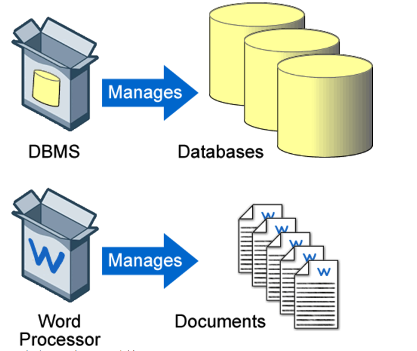

# **Databases**

First,

Let’s understand data:

Data about any person could be their age, gender, address, photo, occupation, health information, likes, dislikes, business data, etc. It’s limitless.

> *"Data can be any piece of information available in any format"*.

It can be raw/unorganized available in text, picture, pdf, audio, sound, etc.

## **Motivation for Databases** ##

**Databases** are everywhere. We go about our daily lives using them. Our phonebook is a database of contacts. Social media websites like Facebook, Twitter, Instagram, etc. store all our data in a database. A library is a large database of books. Google stores details of pages we search in a database.

> *Simply put, a database is a collection of data. It is a container which helps organize data for easy retrieval. At its simplest, a database is made up of tables that contain columns and rows.*

For example, the text file in the image is technically a database containing values separated by a comma. The comma separates each field/column within a row. This gives the file its structure.

[Figure 1]()

Each row represents a different record which is basically a different artist. The structure of this file makes it easy to retrieve data for such files (very small sample).

We can also store and structure data using an excel spreadsheet. Excel naturally organizes data into rows and columns, making it easy to read and retrieve. In addition, it also provides us the ability to format or sort columns.

 ## **Motivation for Data Base Management System (DBMS)** ##

Let’s say a university has around ~ 1 TB of data and we decide to use our file-based system from the previous example. Data of the students will be available to different departments, accounting section, recreation etc. Some of the fields like Student Id, Phone, Address will be common across these sections.

 This will cause the following issues:

  1.	*Data Redundancy* : If a student changes his phone number, it would have to be updated across all sections. Copied data across multiple files will cause redundancy.

  2.	*Inconsistency of Data*: If data across sections do not match each other, it will cause inconsistency.

  3. *No Concurrency*:  Multiple users accessing the same data at the same time is concurrency. Concurrency is not possible with file system.

  4. *Difficult to Access*: Without knowing the exact location of the data, traversing through a large sample in a file system is tedious.

## **DBMS to rescue** ##

Library is a large database of books, then the librarian here will be the DBMS. Through the librarian, we can ask for a certain piece of information who then will go through the library and find the information.

[Figure 2](https://swinbrain.ict.swin.edu.au/wiki/File:DBMSSoftware.gif)

Another analogy can be drawn with a word processor. The word processor like DBMS is a software program and is used to manipulate documents. The documents themselves are similar to a database and can be manipulated by the software.

DBMS is responsible for managing the database. It allows users:
1.	Insertion, Modification, and Deletion of actual data in database

2.	Retrieval of data from the database

3.	User administration which includes security, monitoring performance, dealing with concurrency, etc.

## **Conclusion** ##

The DBMS evolved from the File System and is extensively used. Though still, the file system will be preferred for small to very small sample databases.

## **Citations** ##

1. https://www.youtube.com/watch?v=Ls_LzOZ7x0c

2. http://www.geeksforgeeks.org/database-management-system-introduction-set-1/

3. https://swinbrain.ict.swin.edu.au/wiki/Database_Management_Systems_Introduction

4. https://www.youtube.com/watch?v=t8jgX1f8kc4

5. https://swinbrain.ict.swin.edu.au/wiki/File:DBMSSoftware.gif
